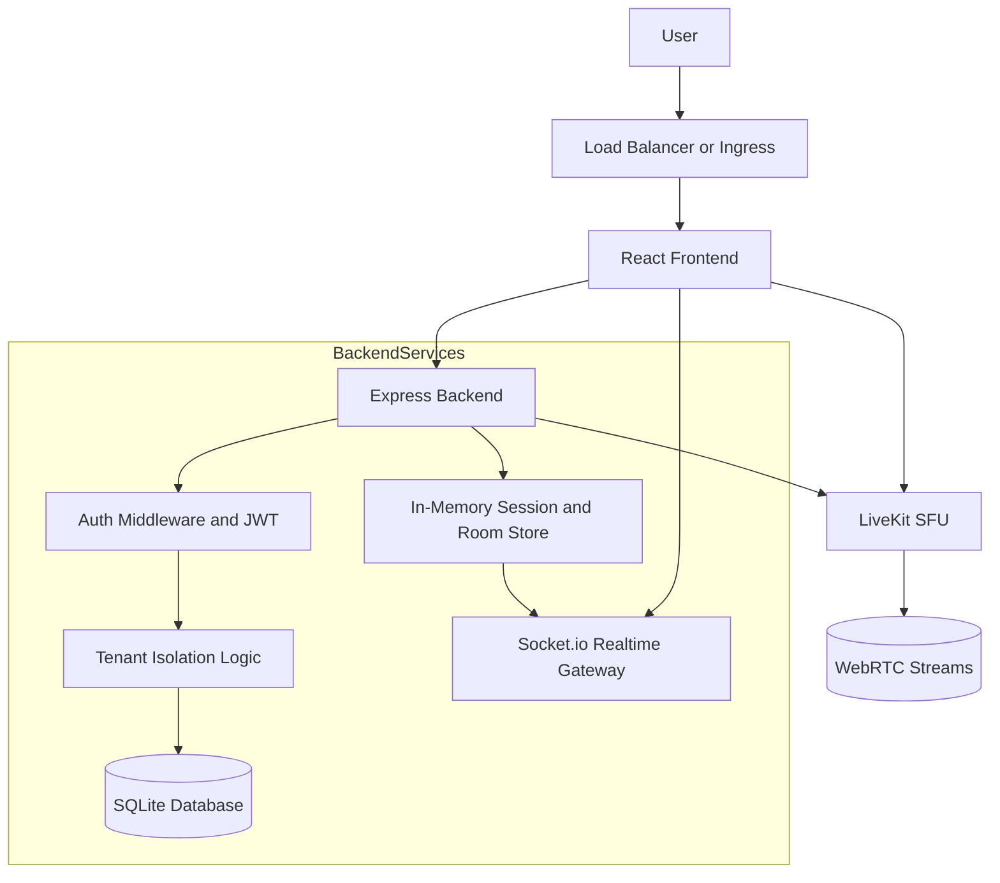
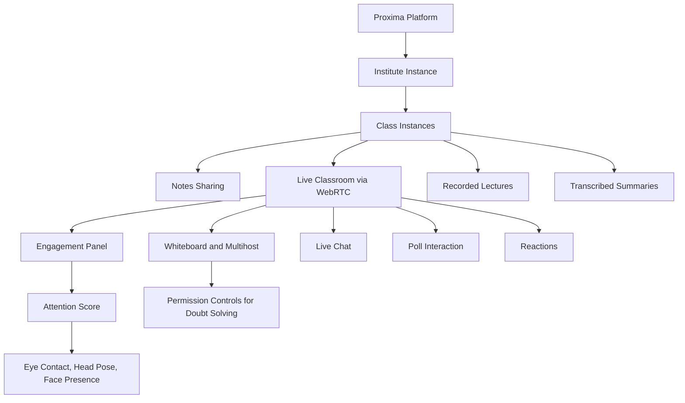

# Proxima [Google Meet But Better]
>Built at SCSITC Hackathon 2026 in collaboration with : [Animesh](https://github.com/animishraa05), [Abhishek](https://github.com/Abhishek4852), and [Akshita](https://github.com/akshita777).

Proxima combines **LiveKit-powered** audio/video with teacher controls, student engagement tools, and AI-assisted learning workflows. Our UI follows a bold **Neobrutalism** visual style for high contrast, clear affordances, and fast interactions during live classes.


## 🏗️ Architecture & Workflows

### System Architecture


### Product Workflow


---

## ✨ Core Capabilities

### 🎓 Classroom and Roles
- **Teacher & Student Views:** Tailored, role-based experiences.
- **Room Management:** Room creation and code-based joining.
- **Live Presence:** Real-time participant updates and session states.

### 🎥 Realtime Media (LiveKit)
- Secure, token-based LiveKit room join.
- Teacher & student camera/mic controls.
- High-quality teacher screen sharing & audio broadcasting.

### ⚡ Live Engagement Features
- **In-Class Reactions:**
  1. Got it 👍
  2. Confused 😕
  3. Too fast 🐇
  4. Repeat 🔄
- **Raise Hand:** Student raise/lower hand workflow with teacher-side visibility.
- **Attention Tracking:** Real-time student attention scoring and live engagement panel.

### 🖍️ Collaborative Teaching Tools
- **Whiteboard Mode:** Live drawing and annotation stream synced across participants.
- **Teacher Controls:** Mute-all event broadcasts and whiteboard clear commands.

### 💬 Communication and Interaction
- **Live Chat:** Real-time classroom chat panel.
- **Polling:** Teacher-created timed polls, live tally updates, and end results.

### 🤖 AI Assistant
- **Gemini Assistant:** Contextual AI classroom assistant panel for instant educational support.
- Powered by a secure, server-side Gemini integration route.

### 🔒 Authentication and Security
- Secure Email/Password registration and login (bcrypt hashing).
- JWT Access + Refresh token flow (persistence & rotation handling).
- Rate-limiting (auth, token, general) and role-based route protection.

---

## 🛠 Tech Stack

- **Frontend:** React, Vite, TypeScript, Tailwind CSS
- **Backend:** Node.js, Express, Socket.io
- **Realtime Media:** LiveKit
- **AI:** Google Gemini API
- **Database:** SQLite (better-sqlite3)
- **Auth:** JWT Access/Refresh tokens

---

## 🚀 Deployment & Configuration

### Production Environment Configuration

Create `server/.env` and configure:

```env
PORT=3001
CLIENT_URL=https://your-frontend-domain.com

LIVEKIT_API_KEY=your_livekit_api_key
LIVEKIT_API_SECRET=your_livekit_api_secret
LIVEKIT_HOST=wss://your-project-name.livekit.cloud

JWT_ACCESS_SECRET=replace_with_a_long_random_secret
JWT_REFRESH_SECRET=replace_with_a_long_random_secret

GEMINI_API_KEY=your_gemini_api_key
```

**Production notes:**
- Use HTTPS for both frontend and backend.
- Use long, random JWT secrets.
- Restrict `CLIENT_URL` CORS to your production frontend domain.
- Keep `.env` out of source control.
- Run the backend with process supervision (e.g., PM2, systemd, or container runtime).

### Production Build

**Frontend Build**
```bash
cd frontend
npm install
npm run build
```
*(Generated build output will be available in `frontend/dist`)*

**Backend Production Start**
```bash
cd server
npm install
npm start
```

---

## 💻 Local Development

1. **Backend Setup:**
```bash
cd server
npm install
copy .env.example .env
npm run dev
```

2. **Frontend Setup:**
```bash
cd ../frontend
npm install
npm run dev
```

**Default Local URLs:**
- Frontend: `http://localhost:5173`
- Backend: `http://localhost:3001`

---

## 📡 API Overview

### Auth Endpoints
- `POST /auth/register`
- `POST /auth/login`
- `POST /auth/refresh`
- `POST /auth/logout`
- `GET /auth/me`

### Room and Token Endpoints
- `POST /rooms/create`
- `GET /rooms/list`
- `GET /rooms/:roomId`
- `GET /token`

### AI Endpoint
- `POST /gemini/chat`

### Real-time Event Surface (Socket.io)
- Room join/leave & live chat history.
- Poll create/respond/live-update/end.
- Attention score updates & Hands raised/lowered.
- Whiteboard state/drawing sync.
- Reactions & teacher mute-all commands.

---

## 📂 Repository Structure

```text
frontend/
  src/
    app/
      components/
      context/
      pages/
    hooks/
    styles/
    types/
server/
  src/
    database/
    middleware/
    routes/
    socket/
    store/
```

---

## 🛡️ Security Summary

- Passwords hashed with `bcrypt`.
- Access and Refresh JWT flow implemented.
- Refresh tokens stored securely and validated server-side.
- API routes protected via `auth` and `authorize` middleware.
- Abuse protection enabled via `express-rate-limit`.

